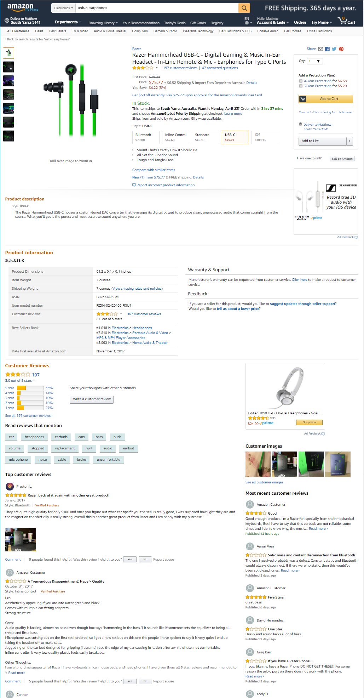
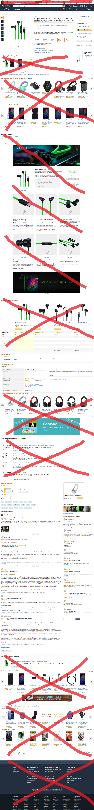

# AmazonMonkey

GreaseMonkey script to remove clutter from the Product page on Amazon.com

## How to use
- Install a GreaseMonkey extenion in your browser
- Use the extension's "create new" functionality, and copy paste the `RemoveClutter.js` contents into the script window
- Refresh your Amazon page; the 

## Functionality
Removes all elements but the following:

- Header
- Breadcrumb
- Product image, price and order buttons
- Product info panel
- Reviews

This means that all the clutter of sponsored recommendations, banners, Q&A etc are all gone. 

<table>
<tr>
<td valign="top"></td>
<td></td>
</tr>
</table>

Enjoy.